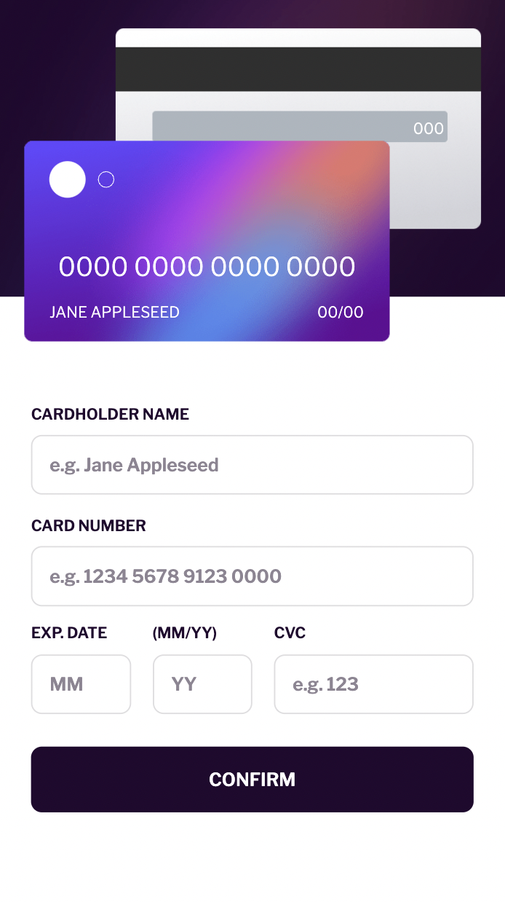

# Frontend Mentor - Interactive card details form solution

will this still be here?

This is a solution to the [Interactive card details form challenge on Frontend Mentor](https://www.frontendmentor.io/challenges/interactive-card-details-form-XpS8cKZDWw). Frontend Mentor challenges help you improve your coding skills by building realistic projects.

## Overview

### The challenge

Users should be able to:

- Fill in the form and see the card details update in real-time
- Receive error messages when the form is submitted if:
  - Any input field is empty
  - The card number, expiry date, or CVC fields are in the wrong format
- View the optimal layout depending on their device's screen size
- See hover, active, and focus states for interactive elements on the page

### Screenshot



### Links

- Solution URL: [Add solution URL here](https://your-solution-url.com)
- Live Site URL: [Add live site URL here](https://your-live-site-url.com)

## My process

For the design I opted for a mobile first approach utilising SASS.

When it came to the form validation I decided to use REGEX in a layered approach so that
the error messages are more specific.
I created an object that mapped required functions and html elements to each input in
order to keep the cody tidy.

### What I learned

I learned some basic REGEX.
I also learned the importance of contemplating the functionality of the project before
styling the html using sass because having to wrap things in new divs once you have
implemented styles can be a hassle.

Here is the object I used to link together functions and elements.
the keys are element IDs

```js
const INPUT_MAP = {
  "form-name": {
    function: formatName,
    cardInput: ".card-name",
  },
  "form-card-number": {
    function: formatNumber,
    cardInput: ".card-number",
  },
  "form-mm": {
    function: formatMM,
    cardInput: ".card-mm",
  },
  "form-yy": {
    function: formatYY,
    cardInput: ".card-yy",
  },
  "form-cvc": {
    function: formatCVC,
    cardInput: ".card-security-code",
  },
}
```

### Continued development

Use this section to outline areas that you want to continue focusing on in future projects. These could be concepts you're still not completely comfortable with or techniques you found useful that you want to refine and perfect.

**Note: Delete this note and the content within this section and replace with your own plans for continued development.**

### Useful resources

The Net Ninja - Regular Expressions (RegEx) Tutorial
https://www.youtube.com/playlist?list=PL4cUxeGkcC9g6m_6Sld9Q4jzqdqHd2HiD
